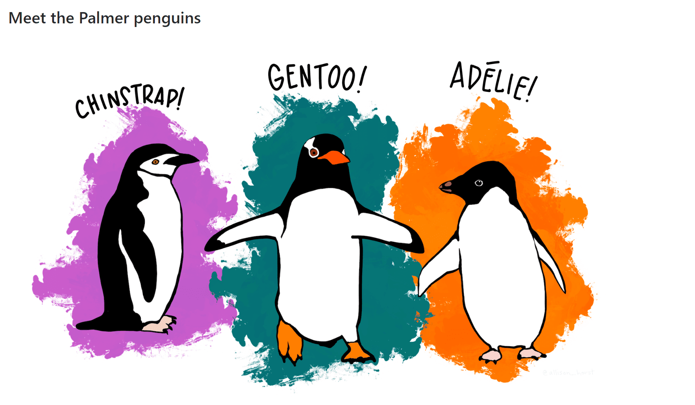

# Delete all variables 
```{r}
rm( list = ls() )
```

```{r pressure, echo=FALSE, out.width = '100%'}

```

# Data Preparation and first Insights


## Import Data

- Download the data from Moodle
- Import the data using the function read.csv()
- Create a dataframe for it using the function data.frame()
- Have a look at the first rows using the function head()
- Have a look at the last rows using the function tail()


```{r}
data = read.csv("C:/Users/Dari-Laptop/Desktop/FH Karnten - Master - AppDs/StatisticsAppDSLaptop/penguins_lter.csv")

```

## What are the column names of the data?

Use the function names()

```{r}
names(data)
```


## What are the data types of each column?
```{r}
str(data)
```

Data types:

- Nominal: 
  - studyName
  - Species
  - Region
  - Island
  - Gender
  - Comments
  - Clutch.Completion
- Ordinal:
  - Individual.ID
  - Date
- Discrete:
  - Body Mass
  - Sample.Number
  - Flipper.length
- Continuous:
  - Culmen.Length
  - Culmen.Depth
  - Delta.15
  - Delta13
  
## Delete some columns

Delete the following columns since we won't need them in this class: 

- studyName, 
- Region, 
- Stage, 
- Clutch.Completion, 
- Date.Egg, 
- Delta.15.N..o.oo., 
- Delta.13.C..o.oo., 
- Comments 


Use therefore the function %in%
```{r}
drop <- c('studyName', 'Region', 'Stage', 'Clutch.Completion', 'Date.Egg', 'Delta.15.N..o.oo.',
          'Delta.13.C..o.oo.', 'Comments')

df = data[,!(names(data) %in% drop)]

head(df)
```

## Rearrange the data

Put the column "Individual.ID" to first column
```{r}
reorder = c("Individual.ID", names(df[,names(df)!="Individual.ID"]))
reorder

df <- df[, reorder]
head(df)
```


## Rename columns

Rename the columns to 

- IndividualID
- Species
- Island
- CulmenLength(mm)
- CulmenDepth(mm)
- FlipperLength(mm)
- BodyMass(g)
- Gender

```{r}
## Rename
names(df)[1] = "IndividualID"
names(df)[2] = "Species"
names(df)[3] = "Island"
names(df)[4] = "CulmenLength(mm)"
names(df)[5] = "CulmenDepth(mm)"
names(df)[6] = "FlipperLength(mm)"
names(df)[7] = "BodyMass(g)"
names(df)[8] = "Gender"

head(df)
```


## What are the three types of Species?

Use therefore the function unique()

```{r}
# unique

unique(df$Species)
```

## Rename the Species types 

Rename the types to 

- Adele
- Chinstrap
- Gentoo

```{r}
# rename species


df$Species[df$Species=="Adelie Penguin (Pygoscelis adeliae)"] = "Adele"
df$Species[df$Species=="Chinstrap penguin (Pygoscelis antarctica)"] = "Chinstrap"
df$Species[df$Species=="Gentoo penguin (Pygoscelis papua)"] = "Gentoo"

unique(df$Species)

head(df)
```
## Missing Values

### How many rows contain missing values?

```{r}
summary(df)
```


### How many rows have empty entries in the qualitative columns?

```{r}
# rows that have empty entries in the qualitative columns

# first method
qualitative = dplyr::select_if(df, is.numeric)
head(qualitative)
summary(qualitative)


# second method
cnt = rowSums(is.na(df) | df == "") > 0
sum(cnt)
```


### Data Imputation

What about data imputation? Check the rows with NA values. Can you apply data imputation on it?

```{r}

```


## Create Dataframe DataWithoutGender  

- Select the rows where the gender is unknown and create a new data set for it. Name it "PenguinsWithoutGender"
- Delete the rows with NA values in the quantitative columns by using the function na.omit() 
- replace "." by "" in the column Gender
- save it to a csv file called "DataWithoutGender.csv" (we will classify the missing gender data later). 

For the **csv saving**: 

- Use  either write.csv() or write.csv2() depending on your system's language: 
if english use write.csv()
if german use write.csv2()
- use row.names = FALSE to exclude the row indices
--> for a smoother workflow

```{r}

```

## Create Dataframe PenguinsWithoutMissingValues   

- Delete the rows with NA values in the quantitative columns by using the function na.omit() 
- Delete the rows with missing values in the gender column
- save it to a csv file called "PenguinsWithoutMissingValues.csv" 

For the **csv saving**: 

- Use  either write.csv() or write.csv2() depending ob your system's language: 
if english use write.csv() 
if german use write.csv2()
- use row.names = FALSE to exclude the row indices
--> for a smoother workflow

```{r}

```

