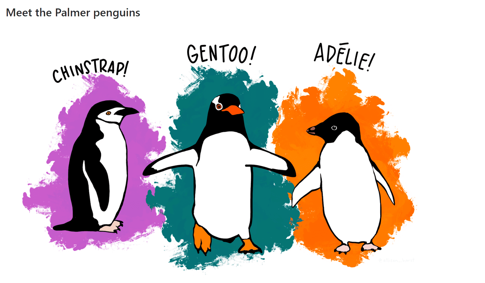

```{r pressure, echo=FALSE, out.width = '100%'}

```

# Please interprete all results you get as well!

 
```{r}
# Delete all variables
rm( list = ls() )
```

```{r}
# Import libaries
library(ggplot2)
library(GGally)
library(dplyr)
library(plotly)
```

# Import Data

Import the dataframe PenguinsWithoutMissingValues from the csv file. 

Use therefore the function read.csv() or read.csv2() depending on your system's language (for a correct "." and "," interpretation) 


```{r}
# Import the dataframe PenguinsWithoutMissingValues from the csv file.
data = read.csv("C:/Users/Dari-Laptop/Desktop/FH Karnten - Master - AppDs/StatisticsAppDSLaptop/PenguinsWithoutMissingValues.csv")
```

# Descriptive Analysis

1) How many obserations are there?

```{r}
# 1) How many obserations are there?
count(data)
```
There are **333** observations.

2) What are the names of the observed variables?

```{r}
# 2) What are the names of the observed variables?
names(data)
```
The names of observed variables are:

- IndividualID
- Species
- Island
- CulmenLength(mm)
- CulmenDepth(mm)
- FlipperLength(mm)
- Bodymass(g)
- Gender

3) How many penguins per Species are there?

Use therefore the library dplyr with the functions group_by() and summarize()
```{r}
# 3) How many penguins per Species are there?
data %>% count(Species)
```
There are:

- **146** Adele species
- **68** Chinstrap species
- **119** Gentoo species


4) How many penguins per Species and Gender are there?

Use therefore the library dplyr with the functions group_by() and summarize()
```{r}
# 4) How many penguins per Species and Gender are there?
data %>% 
  group_by(Species, Gender) %>%
  summarise(n = n())
```
There are: 

- **Adele**
  - 73 Male species
  - 73 Female species
- **Chinstrap**
  - 34 Male species
  - 34 Female species
- **Gentoo**
  - 61 Male species
  - 58 Female species

5) BodyMass statistics per Species and Gender

Create a table with following information; 
Per Species and Gender: 

- the amount of observations, 
- minimum of BodyMass, 
- median of BodyMass, 
- average of BodyMass, 
- maximum of BodyMass. 

Use therefore the library dplyr with the functions group_by() and summarize()

```{r}
# 5) BodyMass statistics per Species and Gender
# 
# Create a table with following information; 
# Per Species and Gender: 
#   
# - the amount of observations, 
# - minimum of BodyMass, 
# - median of BodyMass, 
# - average of BodyMass, 
# - maximum of BodyMass.

data %>%
  group_by(Species, Gender) %>%
  summarise(Observations = n(), 
            Minimum = min(BodyMass.g.),
            Median = median(BodyMass.g.),
            Average = mean(BodyMass.g.),
            Maximum = max(BodyMass.g.))
```
This gives us the following results:

- **Adele**
  - Female species
    - 73 observations
    - 2850g minimum body mass
    - 3400g median body mass
    - 3368.836g average body mass
    - 3900g maximum body mass
  - Male species
    - 73 observations
    - 3325g minimum body mass
    - 4000g median body mass
    - 4043.493g average body mass
    - 4775g maximum body mass
- **Chinstrap**
  - Female species
    - 34 observations
    - 2700g minimum body mass
    - 3550g median body mass
    - 3527.206g average body mass
    - 4150g maximum body mass
  - Male species
    - 34 observations
    - 3250g minimum body mass
    - 3950g median body mass
    - 3938.971g average body mass
    - 4800g maximum body mass
- **Gentoo**
  - Female species
    - 58 observations
    - 3950g minimum body mass
    - 4700g median body mass
    - 4679.741g average body mass
    - 5200g maximum body mass
  - Male species
    - 61 observations
    - 4750g minimum body mass
    - 5500g median body mass
    - 5484.836g average body mass
    - 6300g maximum body mass

6) Quantitative statistics per Species and Gender?

Create a table with following information; 
Per Island, Species and Gender: 

- the amount of observations,
- average of CulmenLength.mm.,
- average of CulmenDepth.mm., 
- average of FlipperLength.mm., 
- average of BodyMass.g.

Use therefore the library dplyr with the functions group_by() and summarize()
```{r}
# 6. Quantitative statistics per Species and Gender?
#   Create a table with following information; Per Island, Species and Gender:
#   
# the amount of observations,
# average of CulmenLength.mm.,
# average of CulmenDepth.mm.,
# average of FlipperLength.mm.,
# average of BodyMass.g.

data %>%
  group_by(Island, Species, Gender) %>%
  summarise(Observations = n(), 
            CulmenLengthAvg = mean(CulmenLength.mm.),
            CulmenDepthAvg = mean(CulmenDepth.mm.),
            FlipperLengthAvg = mean(FlipperLength.mm.),
            BodyMassAvg = mean(BodyMass.g.))
```

This gives us the following results:

- **Biscoe** Island
  - **Adele** species
    - Female
      - 22 observations
      - 37.359mm average CulmenLength
      - 17.704mm average CulmenDepth
      - 187.181mm average FlipperLength
      - 3369.318g average BodyMass
    - Male
      - 22 observations
      - 40.590mm average CulmenLength
      - 19.036mm average CulmenDepth
      - 190.409mm average FlipperLength
      - 4050.000g average BodyMass
  - **Gentoo** species
    - Female 
      - 58 observations
      - 45.563mm average CulmenLength
      - 14.237mm average CulmenDepth
      - 212.706mm average FlipperLength
      - 4679.741g average BodyMass
    - Male
      - 61 observations
      - 49.473mm average CulmenLength
      - 15.718mm average CulmenDepth
      - 221.541mm average FlipperLength
      - 5484.836g average BodyMass
- **Dream** Island
  - **Adele** species
    - Female
      - 27 observations
      - 36.911mm average CulmenLength
      - 17.618mm average CulmenDepth
      - 187.851mm average FlipperLength
      - 3344.444g average BodyMass
    - Male
      - 28 observations
      - 40.071mm average CulmenLength
      - 18.839mm average CulmenDepth
      - 191.928mm average FlipperLength
      - 4045.536g average BodyMass
  - **Chinstrap** species
    - Female
      - 34 observations
      - 46.573mm average CulmenLength
      - 17.588mm average CulmenDepth
      - 191.735mm average FlipperLength
      - 3527.206g average BodyMass
    - Male
      - 34 observations
      - 51.094mm average CulmenLength
      - 19.252mm average CulmenDepth
      - 199.911mm average FlipperLength
      - 4034.783g average BodyMass
- **Torgesen** Island
  - **Adele** species
    - Female
      - 24 observations
      - 37.554mm average CulmenLength
      - 17.550mm average CulmenDepth
      - 188.291mm average FlipperLength
      - 3395.833g average BodyMass
    - Male
      - 23 observations
      - 40.586mm average CulmenLength
      - 19.391mm average CulmenDepth
      - 194.913mm average FlipperLength
      - 40434.783g average BodyMass

7) Provide a summary statistics of the columns 
```{r}
# 7) Provide a summary statistics of the columns

summary(data)
```
As we can see, summary statistics can be applied only to quatitative columns, providing us the minimum, quantiles and maximum.

# Explorative Analysis

## Pairs plot 

- use the pairplot only for quantitative variables
- use different colors for the different Species
- use the function ggpairs from library(GGally)

```{r}
## Pairs plot

ggpairs(data, columns=4:7, ggplot2::aes(colour=Species))
```

As we can see, there is a good correlation between:

- BodyMass and CulmenLength
- BodyMass and FlipperLength
- BodyMass and CulmenDepth


## Histograms, Densities, Boxplots, and Scatterplots and Facets  

### Histogram

1) Use a histogram (from library ggplot) to visualize CulmenLength.mm.

```{r}
ggplot(data, aes(x=CulmenLength.mm.)) + geom_histogram()
```

2) Use different colors for different Species 

```{r}
ggplot(data, aes(x=CulmenLength.mm., fill=Species)) + 
  geom_histogram()
```

3) Use the facet plot for different Species 

```{r}
ggplot(data, aes(x=CulmenLength.mm., fill=Species)) + 
  geom_histogram() + facet_grid(.~Species)
```

4) Use the facet plot for different Species and Gender

```{r}
ggplot(data, aes(x=CulmenLength.mm., fill=Species)) + 
  geom_histogram() + facet_grid(Species ~ Gender)
```

### Density

1) Use a density plot for CulmenLength.mm. for the different Species, facet_grid the Gender

```{r}
ggplot(data, aes(x=CulmenLength.mm., fill=Species)) + 
  geom_density() + facet_grid(.~Gender)
```

2) Use a density plot for CulmenLength.mm. for the different Species, facet_grid the Island

```{r}
ggplot(data, aes(x=CulmenLength.mm., fill=Species)) + 
  geom_density() + facet_grid(.~Island)
```


### Boxplot

Use a boxplot for CulmenLength.mm. for the different Species, facet_grid the Gender

Can you spot any outliers?

```{r}
ggplot(data, aes(x=CulmenLength.mm., fill=Species)) + 
  geom_boxplot() + facet_grid(.~Gender)
```

Yes, there are outliers for:

- **Chinstrap** species
  - Males
  - Females
- **Gentoo** species
  - Males
- **Adele** species
  - Males

### Scatterplot

Use a scatterplot for CulmenLength.mm. and BodyMass.g. 

Create 

- a scatterplot for CulmenLength.mm. and BodyMass.g. 
- color different Species
- facet_grid for Gender

```{r}
ggplot(data, aes(x=CulmenLength.mm., y = BodyMass.g., color=Species)) + 
  geom_point() + facet_grid(.~Gender)
```


## Interactive Plots 

Create 

- a scatterplot for CulmenLength.mm. and BodyMass.g. 
- color the different Species
- facet_grid for Gender
- create a ggploty plot out of it
- add the information of IndividualID in the hoover-text

Can you spot any outliers? What's the IndividualID of the potential outlier? 

```{r}
p = ggplot(data, aes(x=CulmenLength.mm., y = BodyMass.g., color=Species, text = paste("IndividualID :", IndividualID))) + 
  geom_point() + facet_grid(.~Gender)

ggplotly(p)
```

Yes, there are some outliers in our scatter plots:

- **Gentoo** species
  - Male ID N56A2 has a bigger CulmenLength
  - Male ID N39A2 has a bigger BodyMass
- **Chinstrap** species
  - Female ID N71A2 has a bigger CulmenLength
  - Female ID N72A1 has a lower BodyMass


